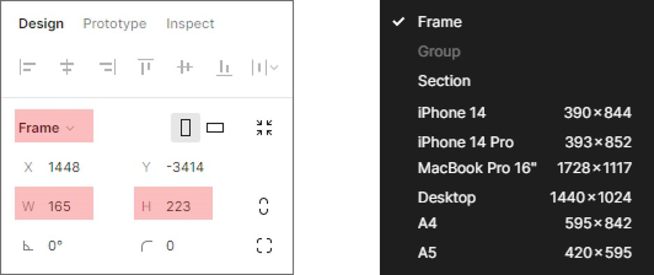
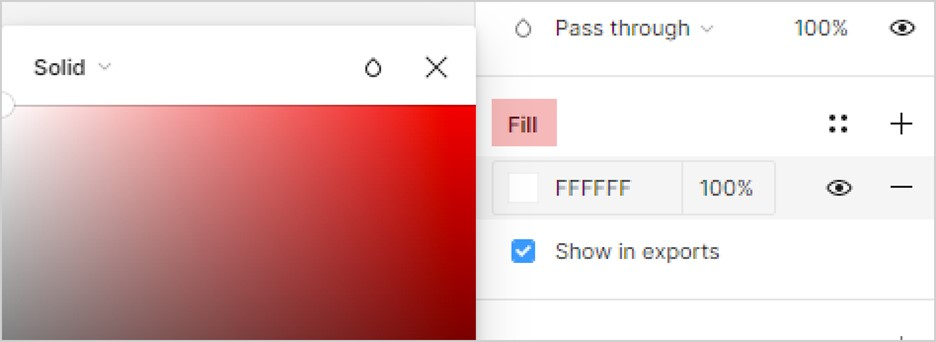
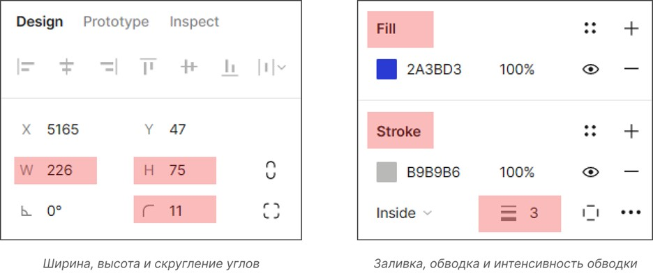
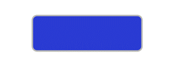
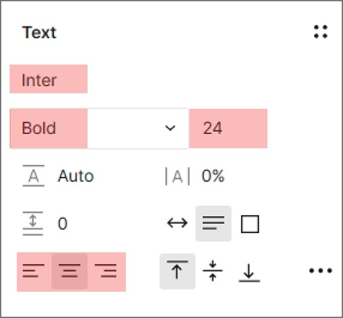
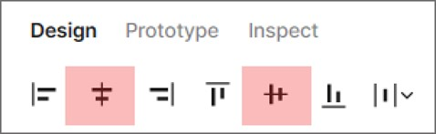

# **Создание и редактирование объектов**

## Создание фрэйма

Фрэйм (Frame) — основной элемент дизайна в Figma, “хост”, внутри которого размещаются сгруппированные объекты. Чтобы создать фрэйм, выполните следующие действия:

1.	Нажмите **символ "Решетка"** на панели инструментов.

2.	Выберите **Frame** из выпадающего списка опций.

3.	Нажмите на произвольное место на рабочей области и удерживайте левую кнопку мыши, чтобы создать фрэйм.

4.	Задайте ширину (**W**) и высоту (**H**) фрэйма вручную или выберите готовый фрэйм из выпадающего списка **Frame** на панели свойств.
*(Среди вариантов фрэймов представлены экраны популярных устройств и часто используемые форматы.)*

5. Задайте цвет фрэйма в разделе **Fill** на панели свойств.

Готово — вы создали фрэйм и определили его основные свойства. 

## Создание формы

Форма (Shape) — базовый объект внутри фрэйма. Формы составляют большинство слоев на странице макета интерфейса. Figma предоставляет набор простых форм, а также позволяет создавать сложные и уникальные формы.

Чтобы на основе формы “Прямоугольник” (Rectangle) создать объект “Кнопка”, выполните следующие действия:

1.	Нажмите **символ "Квадрат"** на панели инструментов.
2.	Выберите **Rectangle** из выпадающего списка опций.
3.	Нажмите на произвольное место внутри фрэйма и удерживайте левую кнопку мыши, чтобы создать прямоугольник.
4.	Задайте размер прямоугольника на панели свойств (ширина **W** и высота **H**).
5.	Скруглите углы прямоугольника с помощью настройки **Corner radius**.
6.	Задайте цвет прямоугольника в разделе **Fill** на панели свойств.
7.	Добавьте обводку в разделе **Stroke** на панели свойств и задайте ее интенсивность.

Готово — вы создали объект “Кнопка” на основе формы “Прямоугольник” и определили ее основные свойства.

## Добавление текста

Текст (Text) — неотъемлемая часть макета интерфейса. Без текста пользователь не поймет, какие действия ему необходимо выполнить на странице сайта, чтобы достичь желаемого результата. 

Чтобы добавить в фрэйм заголовок и текст для кнопки, выполните следующие действия:

1.	Нажмите **символ "T"** на панели инструментов.
2.	Нажмите на произвольное место внутри фрэйма. 
*(Для создания заголовка установите курсор над кнопкой, для текста кнопки — внутри кнопки.)*
3.	Напечатайте текст.
4.	Выберите шрифт из выпадающего списка в разделе **Text** на панели свойств.
*(Обратите внимание, что не все шрифты из списка поддерживают кириллицу. Со списком подходящих для русского языка шрифтов можно ознакомиться здесь.)*
5.	Выберите насыщенность и размер шрифта.
6.	Установите выравнивание текста.
7.	Задайте цвет шрифта в разделе **Fill** на панели свойств.

Готово — вы добавили заголовок и текст для кнопки в фрэйм и определили их основные свойства. 

## Выравнивание объектов

Вы создали фрэйм и наполнили его базовыми объектами. На последнем этапе выровняйте объекты в фрэйме между собой, чтобы создать аккуратный макет. 

1.	Нажмите на текст кнопки.
2.	Нажмите и удерживайте клавишу **Shift** на клавиатуре.
3.	Нажмите на область внутри прямоугольника.
*(Таким образом вы выбрали два объекта одновременно.)*
4.	Нажмите **символ "Две горизонтальные линии"** на панели свойств для выравнивания объектов по горизонтали и **символ "Две вертикальные линии"** для выравнивания объектов по вертикали.
5.	Удерживая левую кнопку мыши, выберите всю область фрэйма и объекты в нем.
6.	Нажмите **символ "Две горизонтальные линии"** на панели свойств для выравнивания объектов внутри фрэйма по горизонтали.

Готово — вы выровняли объекты внутри фрэйма между собой.

Поздравляем! Ваш макет в Figma готов.