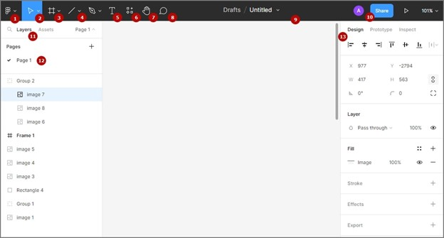

# **Интерфейс и навигация**

## Обзор интерфейса

Ознакомимся с основными элементами интерфейса Figma.

1. Главное меню
2. Перемещение (для перетаскивания объектов)
3. Фреймы
4. Формы
5. Текст
6. Плагины и приложения
7. Рука (для перемещения по рабочей области)
8. Комментарии
9. Имя папки и текущего файла
10. Поделиться ссылкой
11. Панель слоев
12. Список страниц
13. Панель свойств

## Навигация

- Чтобы перемещаться по рабочей области, выберите **символ "Рука"** или удерживайте колесико мыши.
- Чтобы перетаскивать объекты по рабочей области, выберите **символ "Курсор"** или удерживайте объект левой кнопкой мыши.
- Чтобы изменить масштаб рабочей области, выберите **символ "Процент"** в правом верхнем углу экрана или удерживайте на клавиатуре Ctrl и двигайте колесико мыши.
- Чтобы оставить комментарий, выберите **символ "Спич-баббл"** и нажмите на необходимую область.