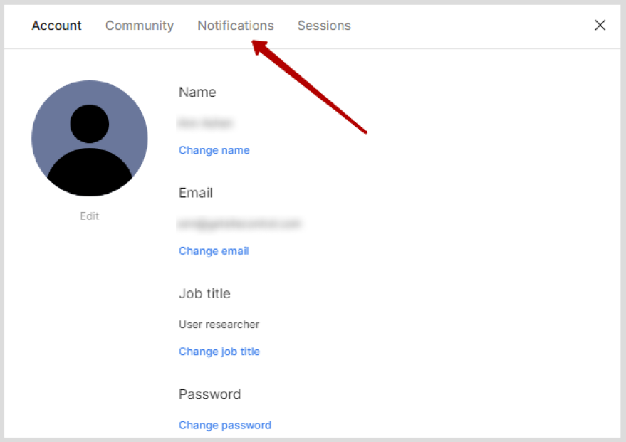

# **Настройка уведомлений**
Чтобы настроить уведомления в Figma, выполните следующие действия:

1. Нажмите на ваше имя в левом верхнем углу экрана. Откроется меню профиля.
2. В меню профиля выберите **Settings**. Появится окно с настройками профиля.
3. В настройках профиля, перейдите в раздел **Notifications**.

4. Чтобы получать сервисные уведомления от Figma, выберите **Send notifications by email**. 
*Обратите внимание, что если вы отключите сервисные уведомления, важные уведомления – о платежах или действиях с учетной записью – все равно будут приходить на ваш электронный адрес.*

5. Если вы включили сервисные уведомления, в пунктах ниже дополнительно настройте, какие уведомления вы хотите получать: 
**- File comments**  — комментарии к доступным вам файлам, упоминания вас в комментариях, ответы на ваши комментарии; 
**- Invites and requests** — приглашения в новые пространства Firgma, запросы доступа к вашим пространствам; 
**- Community comments** — комментарии к опубликованным ресурсам, упоминания вас в комментариях, ответы на ваши комментарии. 
**- Activity digests** - еженедельные сводки с действиями и комментариями в доступных вам ресурсах. 

6. Чтобы получать информационную рассылку с обновлениями и акциями от Figma, выберите **Send me occasional emails with updates and promotions from Figma**.