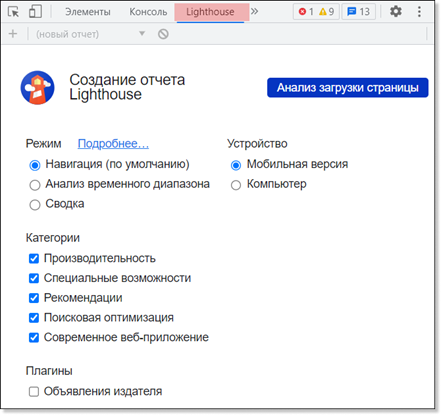
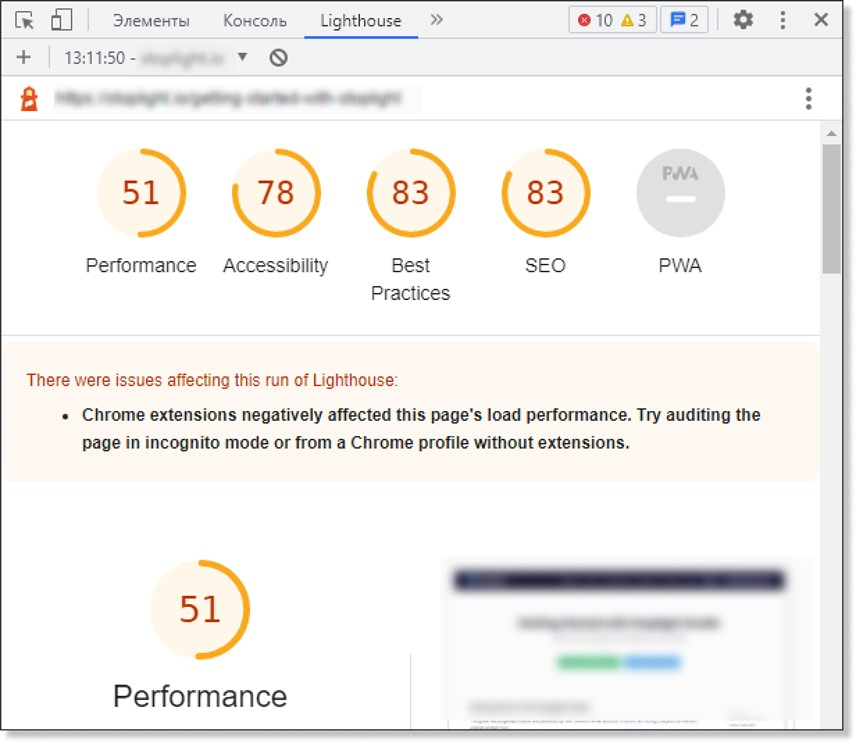

# **Lighthouse**

Google Lighthouse — встроенный инструмент браузера Google Chrome, предназначенный для тестирования различных показателей сайтов.

Инструмент не только проводит разносторонний анализ, но и дает рекомендации по оптимизации сайтов.

Веб-разработчики используют Lighthouse, чтобы повысить производительность, улучшить [поисковую оптимизацию (SEO)](https://developers.google.com/search/docs/fundamentals/get-started?hl=ru) и прочие показатели разработанного ими сайта. Lighthouse дает разработчику конкретные указания о том, чем вызвана низкая производительность или поисковая индексация. Следование этим рекомендациям повышает рейтинг сайта не только в Google, но и в прочих поисковых системах и помогает идти в ногу с постоянно развивающимися технологиями.

Следует отметить, что Lighthouse — продукт Google, поэтому метрики и генерируемые рекомендации соответствуют в первую очередь стандартам Google.

## Категории оценки

Lighthouse предлагает оценить сайт по пяти категориям:

- **Производительность** — скорость загрузки сайта.
- **Специальные возможности** — доступность восприятия и навигации по сайту для всех категорий пользователей.
- **Рекомендации** — лучшие практики, включают в себя проверку безопасности сайта и соответствие современным стандартам разработки.
- **Поисковая оптимизация** — соответствие страницы SEO стандартам Google.
- **Современное веб-приложение** — соответствие [технологии PWA](https://sibdev.pro/blog/articles/chto-takoe-pwa-i-nuzhno-li-eto-vashemu-proektu), адаптированность сайта к использованию на различных устройствах в качестве альтернативы приложениям.

## Режимы анализа

Lighthouse предлагает три режима анализа сайтов:

- **Навигация** — основной режим, анализирует загрузку одной страницы по всем категориям.
- **Анализ временного диапазона** — анализирует работу страницы в произвольный отрезок времени, обычно включающий взаимодействие с посетителями. Режим берет только категории оценки “Производительность” и “Рекомендации”.
- **Сводка** — анализирует страницу в определенном состоянии, обычно после того, как посетитель взаимодействовал с ней. Режим не включает категорию оценки “Современное веб-приложение”.

## Запуск Lighthouse

Lighthouse по умолчанию встроен в панель разработчика браузера Google Chrome. Также можно установить [расширение Lighthouse](https://chrome.google.com/webstore/detail/lighthouse/blipmdconlkpinefehnmjammfjpmpbjk) из магазина Google.

В данном примере запустим Lighthouse в Google Chrome через панель разработчика.

1. Откройте страницу сайта для анализа.
2. Нажмите клавишу **F12** на клавиатуре для вызова панели разработчика.
3. Перейдите во вкладку **Lighthouse**.

4. Выберите **Режим** анализа страницы.
5. Выберите **Устройство**, для которого проводится анализ.
_(Анализ производительности страницы на мобильных устройствах очень важен, так как 80% трафика в современном мире идет от мобильных устройств.)_

6.	Выберите необходимые **Категории** анализа страницы.
7.	Нажмите **Анализ загрузки страницы** (_или иную кнопку в правом верхнем углу, в зависимости от выбранного режима_).

Lighthouse сформирует отчет, где покажет количество очков по шкале от 1 до 100, а также даст необходимые рекомендации.

