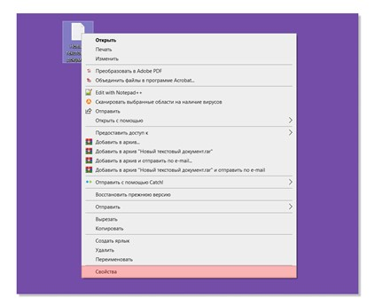
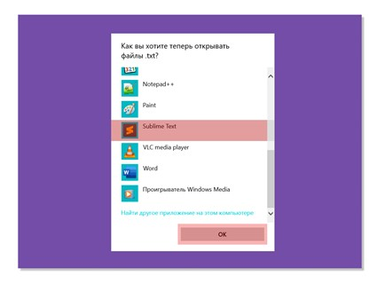

# **Установка Sublime Text**

Sublime Text – это текстовый редактор, разработанный для верстальщиков и программистов, который позволяет работать не только с текстом, но и с кодом разных языков программирования.

Данная инструкция описывает процесс установки Sublime Text на персональный компьютер с операционной системой Windows 10 и выше, а также назначение его в качестве приложения по умолчанию для файлов типа «Текстовый документ (.txt)».

1. Перейдите на официальный сайт текстового редактора [Sublime Text](https://www.sublimetext.com/) (_сайт автоматически определит вашу операционную систему_).
2. Нажмите **Download for Windows**, чтобы скачать установочный файл.

   
4. Запустите установочный файл из папки «Загрузки» (_или иной папки, которую вы установили для скачивания файлов через браузер_).
5. Следуйте указаниям на экране мастера установки.
6. Нажмите правой кнопкой мыши на рабочем столе и выберите **Создать > Текстовый документ**.

   
7. Нажмите правой кнопкой мыши на документ и выберите **Свойства**.

   
8. Нажмите **Изменить** для выбора приложения, открывающего файлы типа «Текстовый документ (.txt)».

   
9. Выберите из списка приложений Sublime Text и нажмите **OK**.

   
10. Убедитесь, что поле приложения изменилось, и нажмите **Применить**.

Готово – все файлы типа «Текстовый документ (.txt)» на вашем компьютере теперь по умолчанию открываются с помощью Sublime Text.
